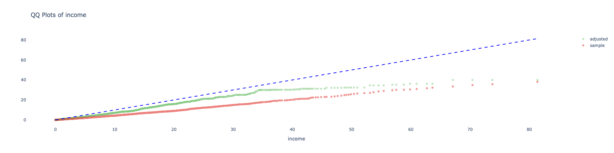
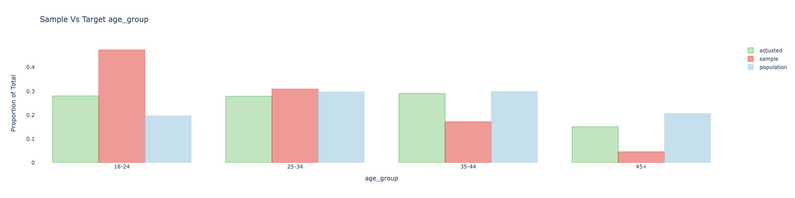
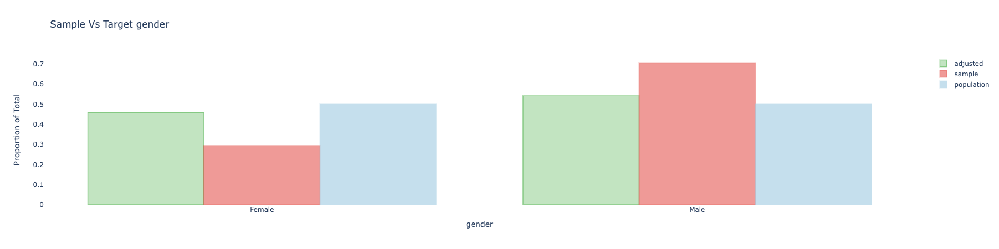
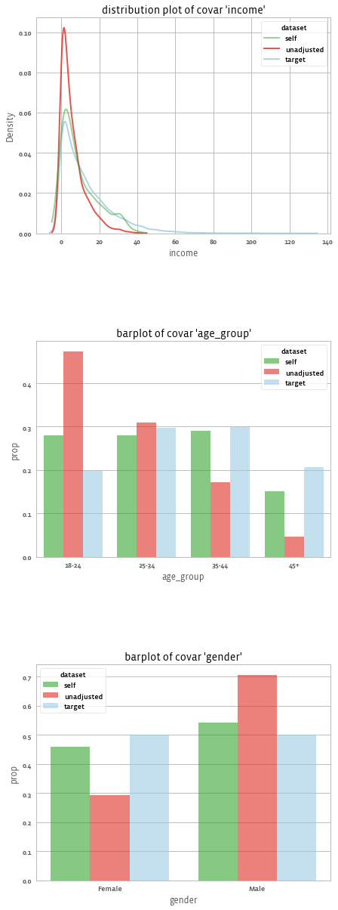
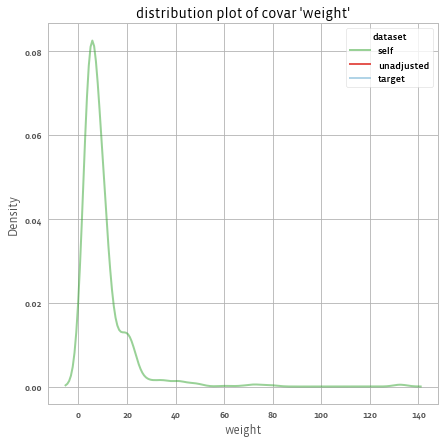
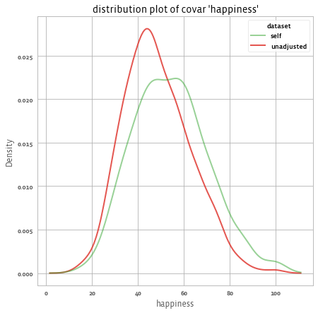

After weights are fitted in order to balance the sample, the results should be evaluated so to understand the quality of the weighting.

## Summary statistics

### Summary

Printing the adjusted object gives a high level overview of the content of the object:

```python
print(adjusted)
```

Output:

```
Adjusted balance Sample object with target set using ipw
1000 observations x 3 variables: gender,age_group,income
id_column: id, weight_column: weight,
outcome_columns: happiness

    target:

    balance Sample object
    10000 observations x 3 variables: gender,age_group,income
    id_column: id, weight_column: weight,
    outcome_columns: None

    3 common variables: income,age_group,gender
```


To generate a summary of the data, use the summary method:

```python
print(adjusted.summary())
```

This will return several results:
- Covariate mean ASMD improvement: ASMD is "Absolute Standardized Mean Difference". For continuous variables, this measure is the same as taking the absolute value of [Cohen's d statistic](https://en.wikipedia.org/wiki/Effect_size#Cohen's_d) (also related to [SSMD](https://en.wikipedia.org/wiki/Strictly_standardized_mean_difference)), when using the (weighted) standard deviation of the target population. For categorical variables it uses [one-hot encoding](https://en.wikipedia.org/wiki/One-hot).
- [Design effect](https://en.wikipedia.org/wiki/Design_effect)
- Covariate mean Adjusted Standardized Mean Deviation (ASMD) versus Unadjusted covariate mean ASMD
- Model proportion deviance explained (if inverese propensity weighting method was used)

Output:

```
Covar ASMD reduction: 62.3%, design effect: 2.249
Covar ASMD (7 variables): 0.335 -> 0.126
Model performance: Model proportion deviance explained: 0.174
```

Note that although we had 3 variables in our original data (age_group, gender, income), the asmd counts each level of the categorical variables as separate variable, and thus it considered 7 variables for the covar ASMD improvement.

## Covariate Balance


We can check the mean of each variable before and after applying the weights using `.mean()`:

```python
adjusted.covars().mean().T
```

To get:

```
source                     self     target  unadjusted
_is_na_gender[T.True]  0.103449   0.089800     0.08800
age_group[T.25-34]     0.279072   0.297400     0.30900
age_group[T.35-44]     0.290137   0.299200     0.17200
age_group[T.45+]       0.150714   0.206300     0.04600
gender[Female]         0.410664   0.455100     0.26800
gender[Male]           0.485887   0.455100     0.64400
gender[_NA]            0.103449   0.089800     0.08800
income                 9.519935  12.737608     5.99102
```

The `self` is the adjusted ASMD, while `unadjusted` is the unadjusted ASMD.


And `.asmd()` to get ASMD:

```python
adjusted.covars().asmd().T
```

To get:

```
source                  self  unadjusted  unadjusted - self
age_group[T.25-34]  0.040094    0.025375          -0.014719
age_group[T.35-44]  0.019792    0.277771           0.257980
age_group[T.45+]    0.137361    0.396127           0.258765
gender[Female]      0.089228    0.375699           0.286472
gender[Male]        0.061820    0.379314           0.317494
gender[_NA]         0.047739    0.006296          -0.041444
income              0.246918    0.517721           0.270802
mean(asmd)          0.126310    0.334860           0.208551
```

We can see that on average the ASMD improved from 0.33 to 0.12 thanks to the weights. We got improvements in income, gender, and age_group.
Although we can see that `age_group[T.25-34]` didn't get improved.


## Understanding the model

For a summary of the diagnostics measures, use:

```python
adjusted.diagnostics()
```

This will give a long table that can be filterred to focus on various diagnostics metrics. For example, when the `.adjust()` method is run with `model="ipw"` (the default method), then the rows from the diagnostics output with `metric == "model_coef"` represent the coefficients of the variables in the model. These can be used to understand the model that was fitted (after transformations and regularization).

## Visualization post adjustments

We can create all (interactive) plots using:

```python
adjusted.covars().plot()
```

And get:







We can also use different plots, using the seaborn library, for example with the "kde" dist_type.

```python
adjusted.covars().plot(library = "seaborn", dist_type = "kde")
```

And get:




## Distribution of Weights

We can look at the distribution of weights using the following method call:


```python
adjusted.weights().plot()
```

And get:



Or calculate the design effect using:

```python
adjusted.weights().design_effect()
# 2.24937
```

## Analyzing the outcome

The `.summary()` method gives us the response rates (if we have missing values in the outcome), and the weighted means before and after applying the weights:

```python
print(adjust.outcomes().summary())
```

To get:
```

1 outcomes: ['happiness']
Mean outcomes:
            happiness
source
self        54.221388
unadjusted  48.392784

Response rates (relative to number of respondents in sample):
   happiness
n     1000.0
%      100.0
```

For example, we see that the estimated mean happiness according to our sample is 48 without any adjustment and 54 with adjustment.  The following shows the distribution of happinnes before and after applying the weights:

```python
adjusted.outcomes().plot()
```

And we get:


