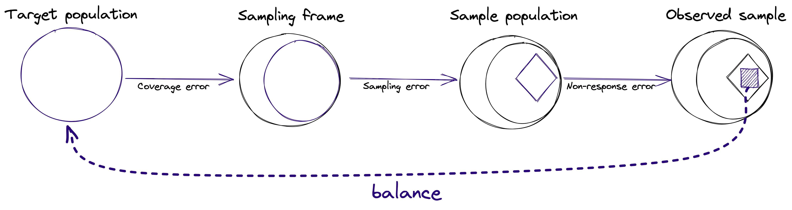

Following the [total survey error](https://en.wikipedia.org/wiki/Total_survey_error) framework, surveys responses are often biased due to coverage error, sampling error and non-response bias [1]. Weighting is often an important step when analyzing survey data. For each unit in the sample (e.g. respondent to a survey), we attach a weight that can be understood as the approximate number of people from the target population that this respondent represents.



The weighting of survey data through balance is done in 6 main steps:

1. **Loading data of the respondents** of the survey. This is done by loading a ```pandas``` DataFrame (using ```pandas.read_csv()``` for example), and then converting the DataFrame into a balance `Sample` class object:
```
sample = Sample.from_frame(sample_df)
```
2. **Loading data about the target population** we would like to correct for. Similarly to loading the respondents data, the next step is to load the target population data and keep it as a balance Sample object. Then, we combine the two `Sample` objects by setting the target object as the target of the sample object:
```
target = Sample.from_frame(target_df)
sample_with_target = sample.set_target(target)
```
3. **Diagnostics of the sample covariates** so to evaluate whether weighting is needed. Several diagnostics tools are available to provide insights on the need to adjust the sample to match the target population. See the [Pre-Adjustment Diagnostics](pre_adjustment_diagnostics.md) page for details.

4. **Adjusting the sample to the target**. Producing the weights for sample to represent the target population distributions. See the  [Adjusting Sample to Population](adjusting_sample_to_population.md) page for details.
```
adjusted = sample_with_target.adjust()
```
5. **Evaluation of the results**. Several tools are available for evaluation of the resulted weights, the amount of bias that the weights reduce, and the estimated [design effect](https://en.wikipedia.org/wiki/Design_effect#Haphazard_weights_with_estimated_ratio-mean_(%7F'%22%60UNIQ--postMath-0000003A-QINU%60%22'%7F)_-_Kish's_design_effect) due to weighting. See the [Evaluation of the Results](evaluation_of_results.md) page for details.

6. **Use the weights for producing population level estimations**. The produced weights are then used to evaluate the population outcome, often the population average (first moment), by using:
```
adjusted.outcomes().summary()
```

7. **Saving the output weights**. To save the output weights, use:
```
adjusted.to_download()
```

All these steps are described in more details in the rest of this website. Examples are available in the [tutorials section](../../tutorials).
For a quick start of using balance with your survey data, take a look at this [notebook](../../tutorials/quickstart.mdx)


## References
[1] Salganik, Matthew J. 2017. Bit by Bit: Social Research in the Digital Age. Princeton, NJ: Princeton University Press. Open review edition.
