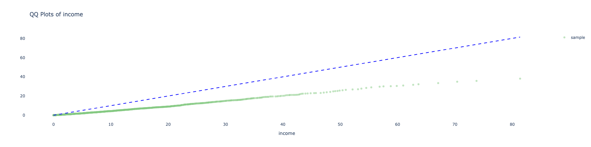
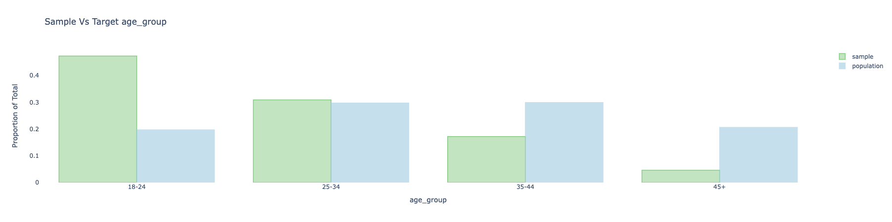
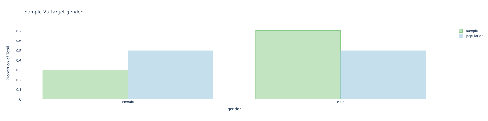

## Covariate balance

A way to check if adjustments are needed is looking at covariate balance by comparing the distribution of covariates in our sample (the respondents before any adjustment), to the distribution of covariates of the population. The same methods will be later used to evaluate the quality of the adjustment in [evaluating the results](evaluation_of_results.md).

There are various methods for comparing covariate balance, either via summary statistics, or through visualizations. The visualizations are implemented either via [plotly](https://plotly.com/python/) (offering an interactive interface) or [seaborn](https://seaborn.pydata.org/) (leading to a static image).

The methods implemented in balance include:
1. Summary statistics
    1. Means
    2. ASMD (Absolute Standardized Mean Difference)
2. Visualizations
    1. Numerical variables
        1. QQ-plots (interactive)
        2. Kernel density estimation (static)
        3. Empirical Cumulative Distribution Function (static)
        4. Histogram (static)
    2. Categorical variables
        1. Barplots (interactive or static)
        2. Probability scatter plot (static)


## Summary statistics

### Means and ASMD (Absolute Standardized Mean Difference)

The mean of the covariates in the sample versus the target is a basic measure to evaluate the distance of the sample from the target population of interest.

For categorical variables the means are calculated to each of the [one-hot encoding](https://en.wikipedia.org/wiki/One-hot) of the categories of the variable. This is basically the proportion of observations in that bucket.

It can be calculated simply by running:
```python
sample_with_target.covars().mean().T
```
An example of the output:

```
source                    self     target
_is_na_gender[T.True]  0.08800   0.089800
age_group[T.25-34]     0.30900   0.297400
age_group[T.35-44]     0.17200   0.299200
age_group[T.45+]       0.04600   0.206300
gender[Female]         0.26800   0.455100
gender[Male]           0.64400   0.455100
gender[_NA]            0.08800   0.089800
income                 5.99102  12.737608
```

(TODO: the one hot encoding acts a bit differently for different variables - this will be resolved in future releases)

The limitation of the mean is that it is not easily comparable between different variables since they may have different variances. The simplest attempt in addressing this issue is using the ASMD.

The ASMD (Absolute Standardized Mean Deviation) measures the difference per covariate between the sample and target. It uses weighted average and std for the calculations (e.g.: to take design weights into account).
This measure is the same as taking the absolute value of [Cohen's d statistic](https://en.wikipedia.org/wiki/Effect_size#Cohen's_d) (also related to [SSMD](https://en.wikipedia.org/wiki/Strictly_standardized_mean_difference)), when using the (weighted) standard deviation of the target population. Other options that occur in the literature includes using the standard deviation based on the sample, or some average of the std of the sample and the target. In order to allow this to be compared across different samples and adjustments, we opted to use the std of the target as the default.

It can be calculated simply by running:
```python
sample_with_target.covars().asmd().T
```
An example of the output:

```
source                  self
age_group[T.25-34]  0.025375
age_group[T.35-44]  0.277771
age_group[T.45+]    0.396127
gender[Female]      0.375699
gender[Male]        0.379314
gender[_NA]         0.006296
income              0.517721
mean(asmd)          0.334860
```

For categorical variables the ASMD can be calculated as the average of the ASMD applied to each of the [one-hot encoding](https://en.wikipedia.org/wiki/One-hot) of the categories of the variable by using the `aggregate_by_main_covar` argument:

```python
sample_with_target.covars().asmd(aggregate_by_main_covar = True).T
```

The output:

```
source          self
age_group   0.233091
gender      0.253769
income      0.517721
mean(asmd)  0.334860
```

An average ASMD is calculated for all covariates. It is a simple average of the ASMD for each covariate.  Each ASMD value of categorical variable is used once after aggregated the ASMD from all the [dummy variables](https://en.wikipedia.org/wiki/Dummy_variable_(statistics)).

## Visualizations

### Q-Q Plot (plotly)

We provide [Q-Q Plots](https://en.wikipedia.org/wiki/Q%E2%80%93Q_plot) as a visual to compare two distributions to one another.

For example, the plot below is a Q-Q plot for the income covariate for the sample against a straight line of the target population:



The closer the line is to the 45-degree-line the better (i.e.: the less bias is observed in the sample as compared to the target population).

To make a QQ-plot for a specific variable, simply use the following method (the default uses QQ plot with the plotly engine):

```python
sample_with_target.covars().plot(variables = ['income',])
```

### Barplots

[Barplots](https://en.wikipedia.org/wiki/Bar_chart) provides a way to visually compare the sample and target for categorical covariates.

Here is an example of the plot for age_group and gender before adjustment:






To make these plots, simply use the following:

```python
sample_with_target.covars().plot(variables = ['age_group', 'gender', ])
```

### Plotting all varibales

If you do not specify a variables list in the plot method, all covariates of you sample object will be plotted:

```python
sample_with_target.covars().plot()
```
